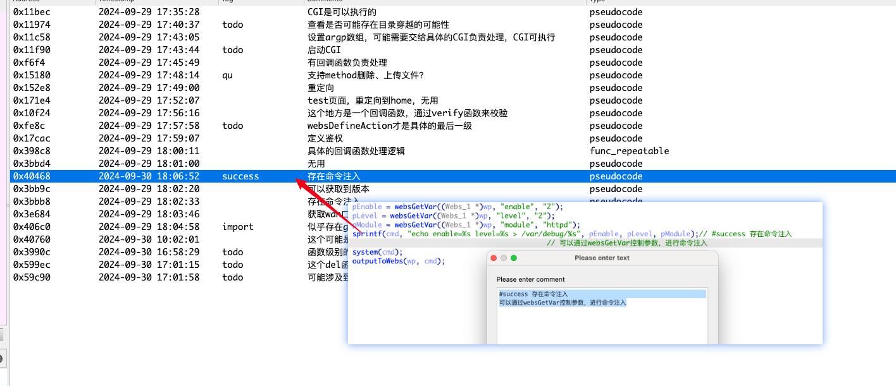

# IDAComments
an IDA plugin helps you to manage your IDA Comments. This repository is forked from [UserComment](https://github.com/JayRE114514/UserComment), and I made a little improvement to make it adapted to my workflow

## Note

This plugin is implemented based on hooking, meaning it can only capture and save the user-added comments after the plugin is installed.

<b>Any user comments added prior to the installation of the plugin will not be captured.</b>

The plugin is written in Python 3, and it's suitable for IDA 7.x and IDA 8.x versions that use Python 3. For IDA 9.x, please test it yourself.

## Installation

Copy the `UserComment.py` file to the `plugins` folder in the IDA installation directory.

## Usage

There are three ways to open the comment window:
1. Choose 'View/Open subviews/Comments' from the menu
2. Use the shortcut (Ctrl-Shift-C)
3. Press `Ctrl-!`, then choose "Comments"

## Features

- Provides a comment window, displaying user-added comments, including comments in assembly code and pseudocode.
- Support for different types of comments (common, repeatable, anterior, posterior, pseudocode and function comments).
- Captured user-added comments will be preserved in the IDB.
- Double-click on a comment entry to quickly navigate to the corresponding location.
- Use IDA's built-in chooser, providing a handy filter functionality.

## Improvements
- Add support for tagging comments, allowing you to categorize and sort them by tags such as #todo, #qu, #success, and more.
- Design a dictionary structure to improve the plugin’s compatibility with potential future extensions.

## Contribution

If you encounter any issues, have suggestions for improvements, or want to add new features, please submit an issue or a pull request.
If you have any other questions, please feel free to ask.